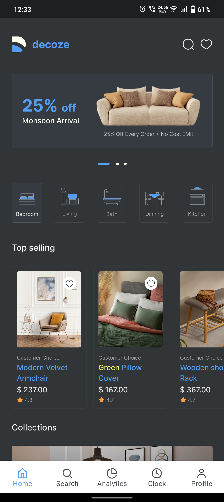
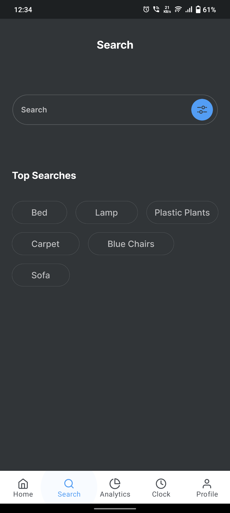
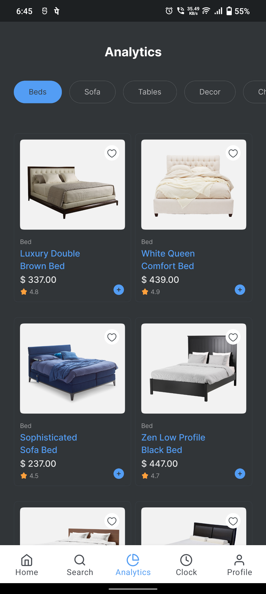
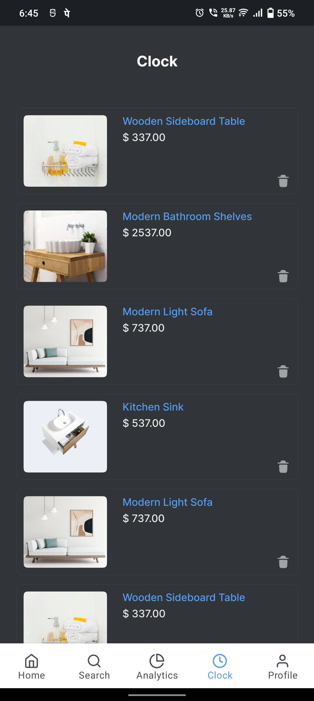
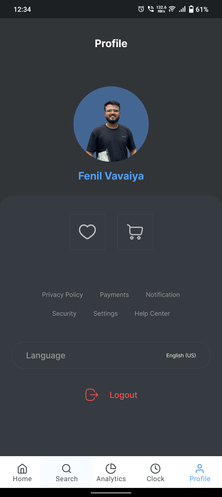

# Bottom Navigation App 

## Overview 

I've built a simple Bottom Navigation app using Jetpack Compose! This project was a fun way to dive deeper into Compose and explore how easily it enables the creation of clean and responsive navigation.

## Features 

- Modern UI: Built entirely using Jetpack Compose, showcasing clean and declarative UI design.

- Bottom Navigation: Smooth and intuitive navigation between screens.

- Responsive Design: Ensures a great user experience across different screen sizes and orientations.

## Demo 
| Home | Search | Analytics | Clock | Profile |
|---|---|---|---|---|
||||||


**Check out the app in action below:**
[Demo Video](https://www.linkedin.com/feed/update/urn:li:activity:7287340908457447424/)


**Getting Started**

Follow these steps to clone and run the project locally:

**Prerequisites**

- Android Studio Bumblebee or later.

- Kotlin version 1.7+.

- Minimum SDK: 21 (Android 5.0).

**Installation**
1. Clone this repository:

   ```bash
   https://github.com/fenil-vavaiya/Navigation-Compose.git

2. Open the project in Android Studio.

3. Sync the project with Gradle.

4. Run the app on an emulator or physical device.

**How It Works**

- Jetpack Compose: Leverages Compose to build the UI with fewer lines of code and enhanced readability.

- Navigation Component: Utilized to handle screen transitions seamlessly.


**Feedback**

I'd love to hear your thoughts! Feel free to open an issue or connect with me on [LinkedIn](https://www.linkedin.com/in/fenil-vavaiya-225696259/ "Fenil Vavaiya").
